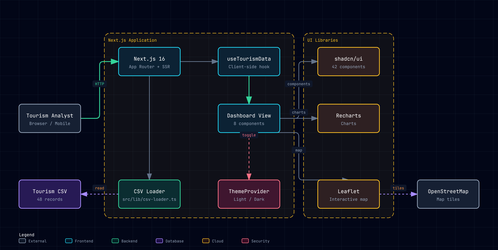

<h1 align="center">Atlas</h1>

<p align="center">
  <strong>Zimbabwe Tourism Destination Insights</strong><br>
  Interactive dashboard for tourism authorities and destination managers
</p>

<p align="center">
  <a href="#features">Features</a> •
  <a href="#quick-start">Quick Start</a> •
  <a href="#architecture">Architecture</a> •
  <a href="#keyboard-shortcuts">Shortcuts</a> •
  <a href="#deployment">Deploy</a>
</p>

<p align="center">
  
  
  
  
  
  
</p>

---

## What is Atlas?

Atlas transforms the POTRAZ AI4I synthetic tourism dataset into actionable insights. It helps tourism authorities and destination managers across Zimbabwe make evidence-based decisions about resource allocation, service quality, and digital transformation.

**8 destinations** • **6 months** • **48 records** • **Real-time filtering**

---

## Features

| Feature | Description |
|---------|-------------|
| **Interactive Map** | Leaflet + OpenStreetMap, bounded to Zimbabwe, circle markers by visitor volume |
| **Smart Filters** | Month, destination type, province — all charts update instantly |
| **Multi-View Analytics** | Complaint themes, revenue ranking, visitor demographics — one dropdown |
| **Auto-Generated Insights** | Narrative bullets computed from filtered data |
| **Priority Actions** | Revenue leakage, service quality, national-level recommendations |
| **Dark/Light Mode** | Theme toggle with localStorage persistence |
| **Keyboard Shortcuts** | Press `?` for 12 power-user shortcuts |
| **Fully Responsive** | 320px mobile to 1920px desktop |
| **Accessible** | WCAG 2.1 AA — contrast, touch targets, screen readers |

---

## Quick Start

```bash
# Clone the repo
git clone https://github.com/your-username/atlas-tourism.git
cd atlas-tourism

# Install dependencies
pnpm install

# Start dev server
pnpm dev

# Open http://localhost:3000/dashboard
```

---

## Architecture

<p align="center">
  
</p>

| Layer | Technology | Purpose |
|-------|-----------|---------|
| **Framework** | Next.js 16 | App Router, SSR, static export |
| **UI** | shadcn/ui + Tailwind 4 | 42 accessible components |
| **Charts** | Recharts | Line, bar, stacked bar charts |
| **Map** | Leaflet + OpenStreetMap | Interactive Zimbabwe-bounded map |
| **Data** | CSV parser | 48 tourism records, parsed at build time |
| **State** | React hooks | Filter logic, KPI aggregation, insight computation |

---

## Keyboard Shortcuts

Press <kbd>?</kbd> anywhere to open the shortcut overlay.

| Key | Action |
|-----|--------|
| <kbd>M</kbd> | Focus month filter |
| <kbd>R</kbd> | Reset all filters |
| <kbd>D</kbd> | Toggle dark/light mode |
| <kbd>1</kbd>-<kbd>4</kbd> | Jump to dashboard section |
| <kbd>Tab</kbd> | Navigate between elements |
| <kbd>Enter</kbd> | Activate button/link |
| <kbd>Space</kbd> | Toggle filter chip |

---

## Project Structure

```
src/
├── app/
│   ├── layout.tsx          # Root layout with providers
│   ├── page.tsx            # Redirect to /dashboard
│   └── dashboard/
│       ├── page.tsx        # Server component (CSV load)
│       └── layout.tsx      # Sidebar + header layout
├── components/
│   ├── dashboard/
│   │   ├── dashboard-view.tsx      # Main orchestrator
│   │   ├── kpi-strip.tsx           # 5 KPI cards
│   │   ├── filter-bar.tsx          # Month, type, province
│   │   ├── visitor-trend-chart.tsx # Dual-axis line chart
│   │   ├── destination-map.tsx     # Leaflet map
│   │   ├── scorecard-table.tsx     # Destination table
│   │   ├── insight-narrative.tsx   # Auto-generated insights
│   │   ├── action-panel.tsx        # Priority recommendations
│   │   ├── complaint-analysis.tsx  # Multi-view chart dropdown
│   │   └── keyboard-shortcuts.tsx  # Shortcut overlay
│   └── layout/
│       ├── Sidebar.tsx
│       ├── Header.tsx
│       └── Footer.tsx
├── hooks/
│   ├── use-tourism-data.ts         # Data + filter logic
│   └── use-keyboard-shortcuts.ts   # Shortcut handler
├── lib/
│   └── csv-loader.ts               # Server-side CSV parser
└── types/
    └── tourism.ts                  # TypeScript interfaces
```

---

## Dataset

The dashboard uses `04_tourism_destination_insights.csv` — synthetic aggregate sample data provided by POTRAZ for the AI4I Design Track.

| Field | Description |
|-------|-------------|
| `visitor_count` | Monthly visitors per destination |
| `estimated_total_spend_usd` | Total estimated spend |
| `service_quality_score_0_100` | Service quality rating |
| `digital_booking_share_pct` | Online booking adoption |
| `domestic_visitor_share_pct` | Domestic vs international split |
| `top_complaint_theme` | Most reported issue |

> **Note:** This is synthetic data for the challenge — not official tourism statistics.

---

## Team

| Name | Role |
|------|------|
| Lawrence Njobo | Lead Innovator |
| Mazvita Ziwira | UI/UX Designer |
| Anisha Mudani | Data Analyst |
| Tanatswa Mashumba | Technical Writer |

---

## Deployment

### Vercel (Recommended)

```bash
# Push to GitHub, then connect to Vercel
# Or deploy directly:
npx vercel --prod
```

### Netlify

```bash
npx netlify-cli deploy --prod --dir=.next
```

### Static Export

```bash
pnpm build  # Output in .next/
```

---

## Accessibility

Atlas targets **WCAG 2.1 Level AA** compliance:

- **Contrast:** All text passes 4.5:1 ratio
- **Touch targets:** All interactive elements ≥ 44×44px
- **Screen readers:** Charts have `aria-label`, tables have `<caption>`
- **Keyboard:** Full Tab navigation, Enter/Space activation
- **Responsive:** Fluid from 320px to 1920px

---

## Tech Stack

| Technology | Version | Purpose |
|-----------|---------|---------|
| Next.js | 16.2 | Framework |
| React | 19.2 | UI library |
| TypeScript | 5.9 | Type safety |
| Tailwind CSS | 4.3 | Styling |
| shadcn/ui | — | Component library |
| Recharts | 3.8 | Charts |
| Leaflet | 1.9 | Maps |
| react-leaflet | 5.0 | React Leaflet bindings |
| Lucide React | 1.24 | Icons |

---

## License

This project is licensed under the MIT License — see the [LICENSE](LICENSE) file for details.

---

<p align="center">
  Built for the <a href="https://potraz.co.zw">POTRAZ AI4I 2026</a> Design Track
</p>
>>>>>>> Stashed changes
