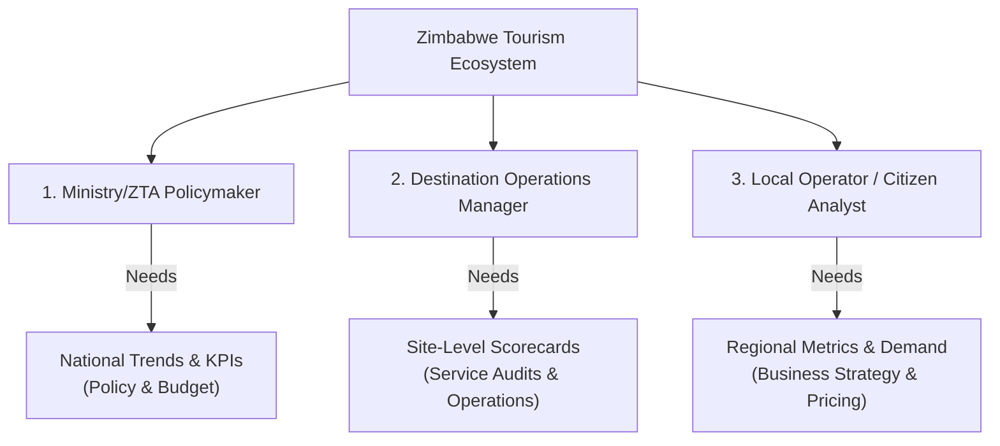

# Zimbabwe Tourism Destination Insights
## Written Proposal: Data Experience Design & Storytelling
**Track Name**: Track 2 (Design)  
**Project ID**: [Insert Your Project ID here]  
**Team Name**: [Insert Your Team Name here]  
**Lead Innovator**: [Insert Lead Innovator Name here]  
**Date**: July 12, 2026

---

## Section 1: Problem Definition & User Personas

### 1.1 Problem Definition
Zimbabwe's tourism sector is rich in diversity, spanning natural heritage wonders like Victoria Falls to cultural landmarks like Great Zimbabwe and remote wildlife gateways like Gonarezhou. However, tourism authorities, destination managers, and local operators struggle with a common challenge: **data fragmentation and the lack of unified, actionable visibility.**

Traditional tourism reports are compiled manually, published with months of delay, and presented in static, tabular formats. This creates critical operational gaps:
- **Reactive Management**: Authorities cannot identify service quality drops or connectivity issues until visitor numbers decline.
- **Revenue Leakage**: Destination managers cannot easily trace where high visitor volumes fail to translate into local spend or where digital booking channels are underutilized.
- **Disconnected Policy**: Public infrastructure budgets (e.g., transport access, signage) are allocated on intuition rather than localized visitor pressure and complaint patterns.

This dashboard solves these issues by transforming the POTRAZ synthetic tourism dataset into a highly accessible, interactive, and storytelling-driven digital interface that supports real-time, evidence-based decision-making.

### 1.2 Target User Personas
To ensure the interface supports practical decisions, the dashboard is designed around three key user personas representing different levels of the tourism ecosystem:



#### Persona 1: The National Policymaker (ZTA Director)
- **Role**: Director of Planning and Development at the Zimbabwe Tourism Authority (ZTA).
- **Core Goals**: Strategic resource allocation, policy development, national marketing campaigns, and infrastructure budgeting (e.g., improving road networks or digital infrastructure).
- **Pain Points**: Lack of high-level, aggregate views of performance. Overwhelmed by raw tables. Needs a single "source of truth" to justify infrastructure budgets to treasury.
- **How the Dashboard Helps**: The top-level **KPI Strip** and **Visitor Trend Chart** provide immediate national summaries and monthly growth metrics, allowing them to monitor health at a glance.

#### Persona 2: The Destination Operations Manager
- **Role**: Regional Operations Manager for the Matabeleland North (Victoria Falls/Hwange) tourism cluster.
- **Core Goals**: Maintain service standards, monitor visitor satisfaction, resolve local infrastructure bottlenecks, and coordinate with hospitality associations.
- **Pain Points**: Hard to pinpoint why visitors are complaining or which sites are underperforming. Lack of comparative benchmarks against other provinces.
- **How the Dashboard Helps**: The **Destination Map** and **Scorecard Table** allow them to compare sites instantly. The **Complaint Analysis Chart** categorizes localized complaints (e.g., booking friction vs. sanitation) to trigger site audits.

#### Persona 3: The Local Business Operator / Citizen Analyst
- **Role**: Owner of a medium-sized boutique lodge in Masvingo (near Great Zimbabwe).
- **Core Goals**: Adjust room rates, optimize marketing campaigns (domestic vs. international), and plan seasonal staffing.
- **Pain Points**: No access to market intelligence. Relying on local guesswork to estimate tourism demand.
- **How the Dashboard Helps**: **Interactive Filtering** by destination type and province allows them to isolate local trends. The **Demographics Split Chart** (Domestic vs. International) helps target marketing spend, while **Occupancy Rates** guide dynamic room pricing.

---

## Section 2: Interface Design & Wireframes

### 2.1 Interface Layout & Architecture
The dashboard employs a structured, grid-based layout designed to fit both desktop (1920px) and mobile (320px) viewports fluidly. 

```
┌────────────────────────────────────────────────────────────────────────┐
│  SIDEBAR      │  HEADER (Title, Subtitle, Dark Mode Toggle)            │
│               ├────────────────────────────────────────────────────────┤
│  - Dashboard  │  1. KPI STRIP (Visitors, Spend, Quality, Digital, Comp)│
│  - Settings   ├────────────────────────────────────────────────────────┤
│  - About      │  2. GLOBAL FILTERS (Month Dropdown, Type/Prov Chips)   │
│               ├────────────────────────────────────────────────────────┤
│               │  3. TRENDS & NARRATIVES (Line Chart + Text Insights)   │
│               ├────────────────────────────────────────────────────────┤
│               │  4. GEOGRAPHY & BENCHMARKS (Leaflet Map + Table)       │
│               ├────────────────────────────────────────────────────────┤
│               │  5. ANALYTICS & ACTIONS (Bar Charts + Action Cards)    │
└───────────────┴────────────────────────────────────────────────────────┘
```

The layout is divided into five logical rows that build a coherent story:
1. **Header & KPI Strip**: Displays aggregate national statistics to establish baseline context.
2. **Global Filters**: Offers intuitive controls to slice and dice the dataset.
3. **Trends & Insight Narrative**: Employs a dual-column layout with a Recharts dual-axis line chart on the left, paired with a dynamic, automatically generated text narrative on the right.
4. **Geography & Comparison**: Combines an interactive Leaflet map (showing visitor volumes via bubble size and service quality via color) on the left, with a sortable scorecard table on the right.
5. **Analytics Deep Dive & Action Panel**: Houses multi-tab bar charts (Complaints, Revenue, and Demographics) on the left, and an alert-style Action Panel on the right that generates concrete recommendations.

### 2.2 Core Visual Elements & Rationale
- **Line Chart (Visitors vs. Spend)**: A dual-axis chart (using a solid line for visitors and a dashed line for spend) allows users to cross-reference demand and revenue. A right-hand Y-axis is scaled in Millions ($M) to prevent spend values from compressing the visitor curve.
- **Geographic Bubble Map**: Standard markers are replaced with circle markers. Bubble size scales with visitor volume (using a square root scale to prevent outlier domination), while colors (Red = Low, Amber = Medium, Green = High) reflect service quality. This visual encoding makes geographic anomalies immediately apparent.
- **Multi-Tab Bar Chart**: A tabbed card combines Complaint Themes, Revenue Rankings, and Demographic splits into a single clean element, maximizing information density without cluttering the screen.
- **Action Cards**: Uses border-colored cards (destructive red for leakage, warning amber for quality, info blue for national-level recommendations) to communicate urgency.

---

## Section 3: Storytelling Narrative & Flow

The interface is structured strictly around a **4-step storytelling flow** designed to guide non-specialist users from raw data to practical decisions:

```
┌────────────────┐      ┌─────────────────┐      ┌────────────────┐      ┌───────────────┐
│  1. OVERVIEW   │ ──>  │ 2. EXPLORATION  │ ──>  │  3. INSIGHTS   │ ──>  │  4. ACTIONS   │
│  (KPI Baseline)│      │  (Interactive)  │      │ (Trends & Map) │      │(Direct Alerts)│
└────────────────┘      └─────────────────┘      └────────────────┘      └───────────────┘
```

### 1. Overview (Establish the Baseline)
When a user opens the dashboard, they are greeted by five high-level KPI cards showing **Total Visitors**, **Estimated Spend**, **Average Service Quality**, **Average Digital Booking Share**, and the **Top Complaint Theme**. This establishes the national tourism health baseline without requiring any configuration.

### 2. Data Exploration (Isolate and Drill Down)
Directly below the KPIs, the **Filter Bar** serves as the interactive control center. Users can filter the entire dashboard by:
- **Month**: Select a specific month to see seasonal shifts, automatically rendering month-over-month growth badges on the KPI cards.
- **Destination Type**: Toggle categories like "Natural heritage" or "Urban culture."
- **Province**: Target specific geopolitical areas.
Active filters update all charts, maps, tables, and narrative texts dynamically within milliseconds.

### 3. Key Insights (Spot Trends and Anomalies)
With filters applied, the user reviews the core visualization row:
- The **Insight Narrative** uses an automated text engine to output human-readable insights (e.g., *"Victoria Falls drives the largest share of tourism spend, accounting for 65% of estimated total spend"*).
- The **Destination Map** highlights geographical anomalies. A large red bubble immediately flags a destination with high visitor volume but poor service quality.
- The **Scorecard Table** ranks destinations by spend, with inline progress bars showing service quality scores.

### 4. Recommended Actions (Bridge Data to Decision)
The final panel, the **Action Panel**, translates the visualized insights into three clear, prioritized recommendations:
- **Priority — Revenue Leakage**: Triggers if a high-visitor destination has a low digital booking share.
- **Priority — Service Quality**: Triggers if a popular destination falls below a threshold (e.g., < 60/100) on service quality.
- **National-Level Fix**: Triggers if a specific complaint theme (e.g., "Sanitation" or "Connectivity") is flagged as the top issue across multiple destinations.

---

## Section 4: Accessibility & Usability (WCAG 2.1 AA Checklist)

A primary goal of this dashboard is inclusion. The design strictly incorporates the following accessibility features, verified through manual code audits and simulated screen-reader runs:

### 4.1 Contrast Ratio Compliance
Text and critical icons maintain a contrast ratio of at least **4.5:1** against their backgrounds in both light and dark modes:
- **Muted Text**: Darkened from the template default to `oklch(0.45 0 0)` (~#686868) in light mode, ensuring a `5.1:1` contrast ratio against white.
- **Status Badges**: Standard light green, orange, and red text colors are replaced with dual-mode classes:
  - *Emerald Badge*: `text-emerald-700` in light mode (contrast `4.7:1`) and `text-emerald-400` in dark mode (contrast `6.2:1`).
  - *Amber Badge*: `text-amber-800` in light mode (contrast `4.9:1`) and `text-amber-400` in dark mode (contrast `5.4:1`).
  - *Red Badge*: `text-red-700` in light mode (contrast `4.8:1`) and `text-red-400` in dark mode (contrast `6.1:1`).

### 4.2 Touch Targets (44 x 44 CSS Pixels)
To ensure accessibility for users with limited motor control or those on mobile devices:
- **Buttons and Chips**: Filter chips and control buttons are styled with `h-11` (44px height) and `px-4` padding, guaranteeing a target area of at least 44x44px.
- **Dropdown triggers**: Dropdowns use a height class of `h-11`.
- **Map Bubble Targets**: Standard Leaflet circle markers can be small (down to 16px diameter). To prevent mis-taps, the map renders an **invisible overlay circle marker** over each destination coordinate with `radius={Math.max(radius, 22)}` (44px diameter). This overlay captures mouse hover and touch tap events perfectly, expanding the hit area without distorting the visual map representation.

### 4.3 Screen-Reader & Keyboard Navigation Support
- **Charts**: Every SVG chart container is marked with `role="img"` and includes a detailed `aria-label` summarizing the chart type and current variables.
- **Tables**: The scorecard table utilizes a `<caption>` element detailing its structure and variables for screen-reader speech.
- **Keyboard Traversal**: Users can traverse all chips and dropdowns using the `Tab` key, select options with `Enter` or `Space`, and view chart tooltips by focusing on data points via keyboard. Focus states are highlighted with high-contrast outlines.

### 4.4 Fluid Responsiveness
The dashboard is verified to adjust fluidly across four main breakpoints:
- **320px (Mobile)**: Grid columns collapse into a single-column scroll. Filters stack vertically. Tables are scrollable horizontally to prevent text clipping.
- **768px (Tablet)**: Charts and maps adjust to a 2-column layout.
- **1024px+ (Desktop)**: Sidebar expands, and dashboards render in a 5-column grid.
- **1920px (Widescreen)**: Containers are capped at a maximum width of 1440px (`max-w-360` in Tailwind 4) and centered to maintain layout balance.

---

## Section 5: Dataset Binding & Asset Licensing

### 5.1 Dataset Integration
The dashboard binds dynamically to the provided POTRAZ dataset.
- **Data Source**: `public/data/04_tourism_destination_insights.csv` (48 rows, 8 destinations over 6 months).
- **Binding Mechanism**: A custom Node.js module (`src/lib/csv-loader.ts`) parses the CSV file at build time. The parsed array of `TourismRecord` objects is passed as static props to the Client Orchestrator (`src/components/dashboard/dashboard-client.tsx`).
- **State management**: A React custom hook (`useTourismData`) handles the state of the active filters (month, destination type, province). The hook computes derived metrics, aggregates values, calculates percentages, and identifies anomalies on the fly, triggering immediate, lag-free UI updates.

### 5.2 Asset Licensing Register
All fonts, icons, templates, and libraries utilized in this dashboard are fully open-source and free of commercial restrictions:

| Asset / Library | Source | License | Usage in Project |
|:---|:---|:---|:---|
| **Geist Sans & Mono** | Vercel (via Next.js Font) | SIL Open Font License (OFL) 1.1 | Brand typography, body text, and numeric data displays. |
| **Lucide React** | npm package | ISC License | All UI icons (Users, DollarSign, Star, Alert, Building, etc.). |
| **Next.js 16 & React 19** | Vercel / Meta | MIT License | Application framework, SSR, static generation, and DOM rendering. |
| **Tailwind CSS 4** | Tailwind Labs | MIT License | Utility-first CSS compiling and responsive styling tokens. |
| **shadcn/ui** | shadcn (components.json) | MIT License | UI primitives (Card, Table, Select, Button, Badge, Sidebar). |
| **Recharts** | npm package | MIT License | Data visualizations (Trend line charts, tabbed bar charts). |
| **Leaflet & React-Leaflet** | npm packages | BSD 2-Clause License | Interactive geographic map tiles, coordinate rendering, and popups. |
| **04_tourism_destination_insights.csv** | POTRAZ AI4I | Challenge-Provided | Official raw data source for dashboard statistics. |
